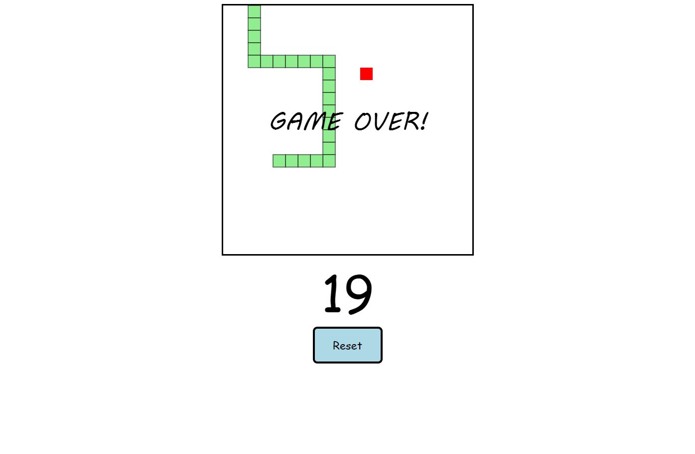

# Snake Game

A classic Snake game implemented using HTML, CSS, and JavaScript.

## Table of Contents

- [Snake Game](#snake-game)
  - [Table of Contents](#table-of-contents)
  - [Demo](#demo)
  - [Features](#features)
  - [Getting Started](#getting-started)
  - [How To Play](#how-to-play)
  - [Contributing](#contributing)

## Demo



## Features

- Classic Snake game mechanics.
- Simple and intuitive controls.

## Getting Started

To run the Snake game locally, follow these steps:

1. Clone the repository:

   ```bash
   git clone https://github.com/MustafaShehata/snake-game.git


2- Open the "index.html" file in your web browser.

## How To Play

* Use the arrow keys (up, down, left, right) to control the snake's direction.
* The goal is to eat the food (represented by a dot) to grow the snake.
* Avoid colliding with the snake's own body and the game boundaries.


## Contributing
If you'd like to contribute to the project, please follow these steps:

1. Fork the repository.
2. Create a new branch: `git checkout -b feature-name.`
3. Make your changes and commit them: `git commit -m 'Add feature'`.
4. Push to the branch: `git push origin feature-name`.
5. Submit a pull request.